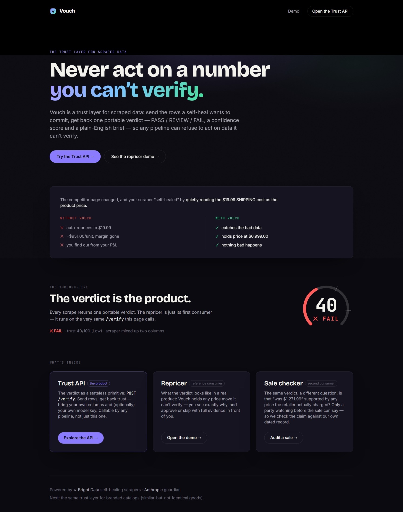

# Vouch

**A trust layer for scraped data — so an automated decision never acts on a number it can't verify.**

The product is one stateless call, `POST /verify`: hand it the rows a self-heal wants to commit, get
back a verdict — PASS / REVIEW / FAIL, a 0–100 confidence score, and a plain-English brief — that any
pipeline can gate on. The repricing console in this repo is its **first consumer**, the proof of what
the verdict looks like in a real product.

Built for [Into the Scrape-Verse](https://www.wemakedevs.org/hackathons/scrape-verse) (Bright Data × WeMakeDevs), 17–23 August 2026.

> **Live Scraper Studio collector:** `c_mszq0z1x27brru3wab` — a custom collector built from the
> Bright Data CLI against [Newegg's GPU category page](https://www.newegg.com/GPUs-Video-Graphics-Cards/SubCategory/ID-48?PageSize=96),
> extracting name / price / shipping / rating / stock for 96 graphics cards in a single run.
> Real output: [`vouch/docs/sample_output.json`](vouch/docs/sample_output.json) ·
> A real heal captured at the approval gate: [`vouch/docs/live_heal_vague.json`](vouch/docs/live_heal_vague.json)



---

## The product: a Trust API any pipeline can call

`POST /verify` is stateless — no database, no repricing, no writes. It's a thin adapter over
`verify_rows` (`run_all_checks → decide → apply_judge`) — **the exact same function the repricer
calls** — over rows you supply, returning the raw verdict. Because 5,000 hackathon teams just built
self-healing scrapers and none of them can answer *"did the heal silently break my data?"*, this is
the piece meant to be dropped into someone else's project.

```bash
curl -X POST "$VOUCH/verify" \
  -H 'content-type: application/json' \
  -d '{
    "candidate_records": [ { "price": 19.99, "shipping": 6900.00 } ],
    "baseline_records":  [ { "price": 6900.00, "shipping": 19.99 } ],
    "is_sample": true
  }'
# → { "decision": "fail", "confirmed": false, "confidence": 40,
#     "brief": "Rejected this heal. 'price' now matches the baseline distribution of 'shipping'…",
#     "failures": [ { "code": "COLUMN_SWAP", … } ], "judge_consulted": false }
```

**It is not pinned to e-commerce.** Bring your own schema and your own model:

- `orderings` — your invariant pairs, e.g. `[["min_salary","max_salary"]]`, so the ordering tier
  guards *your* columns, not `price`/`original_price`.
- `field_descriptions` — what each field is supposed to mean, for the optional semantic judge.
- **Bring-your-own-key judge.** The paid Tier 3 judge runs only when you set `"use_judge": true`
  **and** pass your own key in the `X-LLM-Key` header. `llm.provider` is `"anthropic"` or `"openai"`
  (the latter also reaches any OpenAI-compatible endpoint via `llm.base_url`). No key → the judge is
  a no-op and the free deterministic tiers stand on their own. Vouch never spends its own tokens on
  your call.

```bash
curl -X POST "$VOUCH/verify" \
  -H 'content-type: application/json' \
  -H "X-LLM-Key: $YOUR_MODEL_KEY" \
  -d '{ "candidate_records": [...], "baseline_records": [...],
        "use_judge": true, "llm": { "provider": "anthropic" },
        "field_descriptions": { "price": "the nightly room rate in USD" } }'
```

The verdict schema, the full request contract, and every check code are the interactive **Trust API**
tab in the dashboard. The Trust API has its own OpenAPI docs at **`/trust/docs`** (a standalone
sub-app that exposes *only* `/verify`), so an integrator never wades past the repricer's endpoints.

---

## The first consumer: the repricer

The console below is what the verdict looks like wired into a real product — a repricer that holds
any price move it can't stand behind. Everything from here down is that consumer.


<sub>Three held decisions on real Newegg data. With every source confirmed, the same console is
quiet — see [`screenshot-confirmed.png`](vouch/docs/screenshot-confirmed.png).</sub>

## The problem

Sellers reprice their catalogue against competitors — which means scraping competitor prices
continuously. Bright Data Scraper Studio *self-heals* when a page changes layout: it rewrites the
extraction so data keeps flowing.

**The failure underneath that: a heal can be silently wrong.**

It can start pulling the crossed-out original price instead of the sale price, or the shipping cost
instead of the item price. Right number of rows, right format, right types — wrong meaning. Nothing
in the pipeline reports an error, and a normal repricer happily matches the phantom number.

The real run in this repo makes the stakes concrete. A ZOTAC RTX 5090 lists at **$6,900.00** with
**$19.99** shipping. A heal that quietly swaps those two columns reprices you against a $19.99
competitor — a 345× error that looks perfectly healthy from the outside.

**Vouch validates every proposed heal before it is committed, and holds any price change it can't
stand behind.**

---

## Screenshots

### Repricer — held decisions

When the guardian cannot verify the source, it holds every price change and shows exactly why.
The left panel shows the decision queue with the margin at risk per unit; the right panel shows
Scraper Studio's heal loop as it happened, in plain English.


### Repricer — all sources confirmed

When all sources are verified the queue is quiet. Nothing routine to review; every confirmed source
is already priced where Vouch would put it.


### Guardian evidence — Investigate panel

Click **Investigate** on any held card to see the guardian's full working: the measured evidence
behind the verdict, and the sharpened instruction it wrote back to Scraper Studio for the next
heal attempt.


### Sale checker

The same trust verdict applied to a different question: does a retailer's advertised "was-price"
match any price we actually confirmed before the sale opened?


### Trust API — POST /verify

The stateless trust primitive laid bare. Send rows; get back a portable verdict — PASS / REVIEW /
FAIL, a confidence score, and a plain-English brief. The repricer and the sale checker both run
through this same endpoint.


---

## How it uses Scraper Studio

Scraper Studio isn't a bolted-on scrape here — Vouch **wraps its heal loop**, and the product only
exists because of one specific property of that loop.

| Step | Scraper Studio | Vouch |
|---|---|---|
| 1 | `scraper run` | profile the rows; compare against the stored baseline |
| 2 | — | if a check fires (`NULL_SPIKE`, `FIELD_MISSING`, `ROW_COUNT_SHIFT`), trigger a heal |
| 3 | `scraper heal` → pauses at the gate, `status: "awaiting_approval"` | read `preview_result` — the rows the fix *would* produce |
| 4 | — | **validate them before committing**: confidence 0–100 + PASS / REVIEW / FAIL + a plain-English brief |
| 5 | `scraper approve <id>` / `… --reject` | commit only what we can vouch for; reject the rest |
| 6 | `scraper heal` again | re-prompt with the guardian's own diagnosis, then re-validate |

**Why the gate is the whole thesis.** Bright Data exposes no programmatic collector rollback, so a
wrong `approve` is expensive to undo. The pre-approval gate is the only safe place to stand —
which is why Vouch validates *before* committing rather than monitoring afterwards.

**The property that makes it possible.** Without `--auto-approve`, `heal` pauses and its envelope
carries `preview_result`: the sample rows the fixed scraper would return. Scraper Studio's own UI
shows only the code diff on Accept/Decline. So the CLI/API path surfaces data the approval screen
cannot show a human — exactly the data you need to catch a heal that is *shaped* right and *means*
something wrong. **We never pass `--auto-approve`**; it commits without the gate, which would
delete the thing this product is.

**Step 6 is the part we're proudest of.** `orchestrator._resharpen_prompt` turns the guardian's
machine-readable finding into the next heal prompt — for a `COLUMN_SWAP` it tells Scraper Studio
which column it grabbed, what median it returned, and what that field's own historical range was.
Vouch's validator writes Scraper Studio's next instruction. Capped at 2 attempts, because each one
is a real heal against real credits and a 3-job AI-Flow concurrency cap.

Operational detail — the CLI's undocumented 500-character description cap, the orphaned collectors
a failed `create` leaves behind, the concurrency limit, and the Newegg page quirks the collector
has to survive — is written up in
[`vouch/docs/BRIGHT_DATA_NOTES.md`](vouch/docs/BRIGHT_DATA_NOTES.md).

---

## The two ways a heal lies, and why one check isn't enough

| The heal starts reading… | How far off | What catches it | What it costs you |
|---|---|---|---|
| the **shipping cost** as the price | ~100–345× too low | `COLUMN_SWAP` — the distributions no longer overlap at all | margin: you undercut yourself into the floor |
| the **crossed-out original** as the price | ~14% too high | `VALUE_ORDER_INVERTED` — an invariant, not a statistic | the sale: you price above the market |

The second defeats every distributional check, and that isn't a tuning problem. A 14% shift won't
move a median past `check_numeric_drift`'s threshold, and `check_column_swap` *deliberately
refuses* to compare two fields whose baselines look that similar — for indistinguishable fields,
"closer to the other one" is noise, not evidence.

So Tier 2c uses a different kind of evidence: an **invariant**. A sale price can never exceed the
list price it is discounted from. When that inverts on most rows, it is about as close to proof as
scraped data offers — and unlike every other check it needs no baseline, so it protects the very
first run too.

The two failures also harm you in **opposite directions**, which the held card has to get right:
underpricing destroys margin, overpricing loses the sale. The counterfactual names which one.

---

## Architecture

```
  competitor        ┌──────────────────────── Vouch ────────────────────────┐
  site ────────────▶│                                                        │
                    │  orchestrator.py — scrape → verify → price loop         │
  Bright Data       │       │                                                │
  Scraper Studio ◀─▶│       ├─▶ scraper/brightdata.py   run/heal/approve      │
  (heal loop)       │       │                                                │
                    │       ├─▶ guardian/   ◀── the differentiated core       │
                    │       │     checks.py   tiered validation               │
                    │       │     judge.py    LLM-as-judge (REVIEW only)      │
                    │       │     verdict.py  confidence + risk brief         │
                    │       │                                                │
                    │       └─▶ pricing/engine.py   propose a new price       │
                    │                 │                                      │
                    │           service.py — the only module that writes      │
                    │                 │                                      │
                    │           SQLite ── FastAPI ──────────────────────────▶ │──▶ React dashboard
                    └────────────────────────────────────────────────────────┘    (decision queue)
```

The repricer and every external caller enter through the **same** `verify_rows()` boundary; the
guardian is reached only through it. Four properties are load-bearing:

- **One trust boundary, two entry points.** `POST /verify` is a thin HTTP adapter over `verify_rows`,
  and the repricer's orchestrator calls that identical function — so the repricer is a genuine
  consumer of the Trust API, not a second implementation, and `guardian/` stays private behind it.
- **`orchestrator.py` is pure.** It opens no session and commits nothing; `service.py` is the only
  module that writes rows. The entire cycle — including the retry loop — is testable against
  unsaved objects with no database.
- **Validation is cost-tiered.** Cheap deterministic checks gate the expensive LLM. The Tier-3
  judge is invoked only on `REVIEW` — at most one API call per held cycle — and while it may
  escalate a doubt freely, it may only *clear* a distributional doubt, never a doubt about missing
  data, since it only ever reads the rows that were present.
- **The trust ratchet.** Baselines advance only on guardian-confirmed data, so a bad heal can never
  become the reference the next heal is judged against.

---

## The guardian — validation tiers

| Tier | Checks | What it catches |
|---|---|---|
| 1 | `FIELD_MISSING`, `NULL_SPIKE`, `ROW_COUNT_SHIFT`, `DTYPE_CHANGED` | structural collapse — data stopped flowing |
| 2a | `NUMERIC_DRIFT` | a median moved far from its own baseline |
| 2b | `CARDINALITY_COLLAPSE`, `BOOL_RATIO_SHIFT`, `COLUMN_SWAP` | two columns traded distributions |
| 2c | `VALUE_ORDER_INVERTED` | an invariant flipped (sale price > list price) |
| 2d | `REFERENCE_PRICE_UNSUPPORTED` | a claimed was-price exceeds our pre-sale record |
| 3 | LLM-as-judge (opt-in, bring your own key) | semantic plausibility on REVIEW cases |

Every check returns a `code`, `severity` (`CRITICAL / HIGH / MEDIUM / LOW`), `field`, and
`evidence` dict. The confidence score is additive: each failed check costs a penalty proportional
to its severity, capped at 100. `PASS ≥ 85`, `REVIEW 60–84`, `FAIL < 60` or any CRITICAL finding.

---

## The dashboard

One screen, exception-based: it is a decision queue, not a data display. The seller's job is to
touch only what needs judgement.

- **Routine reprice proposals** — confident changes within the safe margin band, bulk-approvable
  with one click.
- **Held decisions** — the star. Each names the number we refused to act on, the check that caught
  it, a confidence score, and what auto-approving would have cost per unit.
- **Investigate panel** — the guardian's full working: measured evidence (medians, distances,
  distributions) and the re-prompt written from those measurements.
- **Price chart** — hand-rolled SVG with an honest gap on unconfirmed cycles. The gap is in the
  data so it cannot be smoothed over by a library default.
- **Heal event log** — Scraper Studio's loop in its own vocabulary: *run → heal proposed →
  awaiting approval → verdict → committed or rejected*.

Approving a held proposal requires `force=true` and returns `409` without it. That refusal is the
product, not a safety rail bolted on afterwards.

---

## Trust API — `POST /verify`

The stateless trust primitive: send the rows a heal wants to commit, get back one portable verdict.

```bash
curl -X POST "$VOUCH/verify" \
  -H 'content-type: application/json' \
  -d '{"candidate_records": [ … ], "baseline_records": [ … ]}'
```

**Response shape:**

```json
{
  "decision": "fail",
  "confirmed": false,
  "confidence": 40,
  "brief": "Rejected this heal. 'price' now matches the baseline distribution of 'shipping', not 'price'. The heal likely swapped these fields.",
  "failures": [
    {
      "code": "COLUMN_SWAP",
      "severity": "critical",
      "field": "price",
      "message": "…",
      "evidence": { "looks_like": "shipping", "proposed_median": 0.0, "baseline_own_median": 809.99 }
    }
  ],
  "judge_consulted": false,
  "rows_judged": 30,
  "full_battery": true,
  "checks_stood_down": []
}
```

**Optional parameters:**

| Parameter | Type | Purpose |
|---|---|---|
| `baseline_records` | `list[dict]` | raw last-known-good rows; profiles are computed server-side |
| `baseline_profiles` | `dict[str, profile]` | precomputed profiles, for callers that cache them |
| `baseline_count` | `int` | row count to use for `ROW_COUNT_SHIFT`; inferred when omitted |
| `is_sample` | `bool` | preview rows — volume checks stand down, confidence is capped |
| `orderings` | `[[lower, upper], …]` | invariant pairs for `VALUE_ORDER_INVERTED` |
| `reference_prices` | `dict[str, float]` | `name → confirmed_price` for sale-claim audits |
| `use_judge` + `X-LLM-Key` | `bool` + header | opt into Tier 3 with your own model key |

No database, no writes. The repricer and the sale checker both run through this same endpoint.

---

## Quickstart

```bash
git clone https://github.com/aakritiinjapan/Vouch.git
cd Vouch
./demo.sh
```

This installs both halves, seeds the database from the real collector's output, and starts the API
on `http://127.0.0.1:8000` and the dashboard on `http://127.0.0.1:5173`. Runs entirely offline —
no Bright Data or Anthropic credentials required.

**Prerequisites:** Python 3.11+, Node 20+. `make demo` does the same thing.

To run the two halves separately:

```bash
# backend  (from vouch/backend)
python -m venv .venv && source .venv/bin/activate
pip install -r requirements.txt
python -m scripts.seed          # seeds from the real collector output
uvicorn app.main:app --reload   # http://127.0.0.1:8000  (/docs for the OpenAPI explorer)

# frontend  (from vouch/frontend)
npm install && npm run dev      # http://127.0.0.1:5173, proxies /api → backend

# tests  (from vouch/backend)
pytest -q                       # 327 tests across 16 files
```

---

## Configuration

Copy `.env.example` to `.env` and fill in the values you need. The app runs entirely offline by
default — only set keys when enabling the live paths.

| Variable | Default | Purpose |
|---|---|---|
| `MOCK_MODE` | `true` | offline replay against fixtures; set `false` for live Bright Data |
| `DEMO_DATASET` | `newegg_live` | which fixture to replay (`newegg_live` or `sample_runs`) |
| `API_KEY` | _(empty)_ | when set, all mutating endpoints require `X-API-Key: <value>` |
| `ALLOWED_ORIGINS` | localhost | comma-separated CORS origin allowlist |
| `BRIGHTDATA_API_KEY` | — | `@brightdata/cli` credential (heal / approve / reject loop) |
| `BRIGHTDATA_API_TOKEN` | — | Python SDK credential (run collectors) |
| `ANTHROPIC_API_KEY` | — | Tier 3 LLM judge (opt-in, `use_judge: true` on `/verify`) |
| `LLM_JUDGE_MODEL` | `claude-sonnet-4-6` | model used by the Tier 3 judge |

---

## API endpoints

All routes are prefixed at the server root (default `http://127.0.0.1:8000`). The OpenAPI
explorer is at `/docs`.

| Method | Path | Auth required | Description |
|---|---|---|---|
| `POST` | `/verify` | No | Stateless trust primitive — the guardian without a database |
| `GET` | `/products` | No | All tracked products with current prices |
| `GET` | `/products/{id}/history` | No | Price history for the chart (confirmed observations only) |
| `GET` | `/proposals` | No | Decision queue — pending and held by default |
| `POST` | `/proposals/approve-safe` | Yes | Bulk-approve proposals within the safe band |
| `POST` | `/proposals/{id}/approve` | Yes | Approve one proposal (`?force=true` for held) |
| `POST` | `/proposals/{id}/reject` | Yes | Reject / skip a proposal |
| `GET` | `/heal-events` | No | Heal event log |
| `POST` | `/cycles/run` | Yes | Run all product cycles |
| `GET` | `/demo/hints` | No | Available replay scenarios for the active dataset |
| `POST` | `/demo/reset` | Yes | Restore demo opening state (MOCK_MODE only) |
| `GET` | `/health` | No | Health check |

---

## Tests

```bash
cd vouch/backend && pytest -q     # 327 tests across 16 files
```

| File | Tests | What it covers |
|---|---|---|
| `test_heal_lab.py` | 46 | full heal cycle scenarios end-to-end |
| `test_brightdata.py` | 40 | CLI wrapper, row parsing, elision markers |
| `test_template_diff.py` | 36 | JS source diff parsing |
| `test_orchestrator.py` | 33 | cycle with no DB, retry loop, gate/draft/probe |
| `test_verify_endpoint.py` | 25 | stateless `/verify` surface |
| `test_reference_price.py` | 14 | sale-claim audit checks |
| `test_matching.py` | 14 | product name matching against baseline rows |
| `test_judge.py` | 16 | Tier 3 LLM judge (mock mode, field scoring) |
| `test_value_ordering.py` | 16 | `VALUE_ORDER_INVERTED` — proves distributional checks are blind here |
| `test_service.py` | 30 | persistence contract, trust ratchet, supersede logic |
| `test_sample_aware.py` | 12 | Evidence provenance, partial-evidence ceiling |
| `test_guardian_edges.py` | 9 | edge cases in the check battery |
| `test_api.py` | 18 | HTTP-level demo arc: run → break → hold → resume → reset |
| `test_checks.py` | 4 | column-swap detection end-to-end |
| `test_pricing.py` | 7 | floor-margin pricing rules |
| `test_demo_dataset.py` | 7 | live dataset integrity |

---

## Repository layout

```
Vouch/
├── .env.example                  all configurable variables, documented
├── demo.sh / Makefile            one-command bootstrap
└── vouch/
    ├── backend/
    │   ├── app/
    │   │   ├── main.py           FastAPI entry point, CORS, lifespan
    │   │   ├── config.py         Pydantic-settings (reads .env from 3 candidate paths)
    │   │   ├── db.py             SQLite engine + session dependency
    │   │   ├── models.py         Product · Baseline · RepriceProposal · HealEvent · CompetitorObservation
    │   │   ├── orchestrator.py   scrape → guard → price loop (pure — no DB writes)
    │   │   ├── service.py        the only module that writes rows
    │   │   ├── guardian/
    │   │   │   ├── checks.py     tiered validation battery (10 checks, self-describing)
    │   │   │   ├── judge.py      LLM-as-judge, REVIEW cases only
    │   │   │   ├── verdict.py    confidence score + PASS/REVIEW/FAIL + risk brief
    │   │   │   └── template_diff.py  JS source diff parsing
    │   │   ├── pricing/engine.py floor-margin-respecting price proposals
    │   │   ├── scraper/
    │   │   │   ├── brightdata.py CLI wrapper + mock fixture system
    │   │   │   └── baseline.py   capture and update baseline profiles
    │   │   └── api/
    │   │       ├── routes.py     all REST endpoints (thin — no business logic)
    │   │       └── schemas.py    Pydantic response models + builder functions
    │   ├── scripts/              seed · reset_db · create_collector · live_heal
    │   └── tests/                327 tests across 16 files
    ├── frontend/
    │   └── src/
    │       ├── App.tsx           hash router shell (home / console / examples / trust-api)
    │       ├── api.ts            all fetch calls — single source of backend URLs
    │       ├── types.ts          TypeScript mirrors of backend schemas
    │       ├── hooks/
    │       │   ├── useVouch.ts   all state, 5-second polling, mutations
    │       │   └── useRoute.ts   hash router
    │       ├── pages/            Hero · Console · Examples · TrustApi
    │       └── components/       HeldCard · PriceChart · Receipts · VerdictGauge · Nav
    └── docs/
        ├── BRIGHT_DATA_NOTES.md  Scraper Studio traps, measured against the live API
        ├── DEMO_SCRIPT.md        the demo walkthrough
        ├── LIVE_CAPTURE.md       how to film the live collector and heal
        ├── MOTIVATION.md         why this problem
        ├── sample_output.json    the real 96-row collector run
        └── live_heal_vague.json  a real heal captured at the approval gate
```

---

## Demo data — what is real, what is synthetic, and why

The demo uses two data sources. Everything in the repricer is derived from a real live scrape. Everything in the sale checker is synthetic. The distinction is stated precisely here so judges can verify every claim.

### Newegg — real collector output

The repricer runs against real data from Bright Data Scraper Studio collector **`c_mszq0z1x27brru3wab`**, built against [Newegg's GPU category page](https://www.newegg.com/GPUs-Video-Graphics-Cards/SubCategory/ID-48?PageSize=96). The full raw output is committed at [`vouch/docs/sample_output.json`](vouch/docs/sample_output.json).

- **96 rows**, one per GPU listing — ASRock, ASUS, Gigabyte, MSI, ZOTAC, XFX, Sapphire, PowerColor, PNY, ONIX
- **Fields collected:** `name`, `price`, `shipping`, `in_stock`, `rating`
- **Price range:** $139.99 – $6,900.00
- **Shipping:** zero on 94 of 96 rows; two rows carry a non-zero fee — ZOTAC ARCTICSTORM RTX 5090 ($6,900.00 + $19.99) and MSI Gaming RTX 5090 ($4,699.99 + $19.99). These two rows are what make the COLUMN\_SWAP demo concrete: a heal that swaps `price` and `shipping` replaces a $6,900 price with $19.99 — a 345× error.

From that real baseline, three variants are constructed for offline replay:

| Variant | What it represents | How it's constructed |
|---|---|---|
| `baseline` | The clean, confirmed run | 100% real collector output, verbatim |
| `run_degraded` | Layout break — selectors stopped matching | Real rows with `price` nulled on 75% of rows |
| `healed_good` | A correct heal after a price movement | Real rows with prices scaled by 0.992 |
| `healed_swapped` | **The dangerous heal Vouch catches** | Real rows with `price` and `shipping` exchanged |

The construction is documented inside [`vouch/backend/scripts/build_demo_fixture.py`](vouch/backend/scripts/build_demo_fixture.py). The values on both sides of the swap are the collector's own numbers — nothing is invented.

**The three products tracked in the repricer demo** are chosen from the 96 because they are the rows where the swap is most dramatic:

| SKU | Product | Our price | Unit cost | Exposure if swapped |
|---|---|---|---|---|
| `GPU-5090-ZOTAC` | ZOTAC ARCTICSTORM AIO GeForce RTX 5090 | $6,999 | $5,600 | −$951/unit |
| `GPU-5090-MSI` | MSI Gaming GeForce RTX 5090 32G GAMING TRIO OC | $4,779 | $3,820 | −$653/unit |
| `GPU-5090-ASUS` | ASUS ROG Astral GeForce RTX 5090 OC Edition | $4,899 | $3,900 | −$609/unit |

---

### Voltmart — a purpose-built synthetic storefront

**Voltmart does not exist.** It is a fake retailer invented specifically as a test fixture for Vouch. Every product name, price, rating, and stock state is fabricated. The pages carry a footer notice, an HTML comment, and `<meta name="robots" content="noindex, nofollow">` confirming they are test data.

**Why Voltmart exists:** the real Newegg data cannot exercise two of the guardian's most important checks:

1. **COLUMN\_SWAP between `price` and `shipping`** requires non-trivially varying shipping costs. Newegg returns "Free Shipping" on 94 of 96 rows — a field that looks like a constant, not a distribution, so the swap detector has nothing to distinguish it from.
2. **VALUE\_ORDER\_INVERTED** (sale price > original price) requires `original_price` to be present and reliable. Newegg returns it on only ~33% of tiles, and never consistently, so it cannot anchor an invariant check.

Voltmart is designed to fill both gaps: every product has a non-zero, varying shipping fee ($4.99–$24.99), and 22 of 30 products carry an `original_price` set 5–30% above the current price.

**What the storefront contains:**

- **30 synthetic GPU products** — fictitious "Voltix RTX", "Voltix RX", and "Voltix Arc" SKUs
- **Price range:** $89.99 – $2,449.99
- **Fields:** `name`, `price`, `shipping`, `rating`, `in_stock`, `original_price`
- **9 data variants** available for scraping: `clean`, `swap`, `inverted`, `nulls`, `missing`, `collapse`, `instock`, `drift`, `fake_sale`
- **3 adversarial DOM-structure pages** (P1, P2, P3) — layouts designed to break a selector that relies on a specific class or nesting, so the heal loop can be exercised end-to-end against a page the team controls

The sale checker demo uses the **`fake_sale` variant** of Voltmart, in which 3 of 8 products advertise a "was-price" inflated to 1.6× the clean-page price. The `clean` page is the pre-sale baseline. A judge can verify the claim by comparing [`vouch/testbed/index.html`](vouch/testbed/index.html) (clean) against the `fake_sale` dataset in [`vouch/backend/tests/fixtures/sample_runs.json`](vouch/backend/tests/fixtures/sample_runs.json).

The Voltmart pages are hosted on Netlify and three live Bright Data collectors (`c_mt5gwa3w1eknnqzr2`, `c_mt5gye8j2jjqinpxz9`, `c_mt5gyg1d1web67uas2`) are built against the adversarial variants. The generator script is at [`vouch/testbed/generate.py`](vouch/testbed/generate.py).

---

## Data sources and compliance

The collector reads a **public** Newegg category page. No authentication, no paywalled or
login-protected content, no personal data, one request per cycle, and nothing is redistributed.

Newegg's `robots.txt` permits the exact paths used here and specifies no crawl delay, while its
Terms of Use contain a general prohibition on automated access. That tension is standard across
major retail and we note it rather than paper over it; the volume, the public nature of the pages,
and the absence of any authenticated or personal data are why we consider this use appropriate.

`www.newegg.com` is pinned and non-USD prices are refused outright, because `newegg.ca` serves a
different catalogue in CAD and accepting those as USD would silently poison the price history.

---

## What the live run did and did not establish

Stated plainly, because it matters more than a clean claim:

- ✅ **The architecture holds against the real API.** The gate stopped at `awaiting_approval`,
  handed us `preview_result`, the guardian rendered a verdict on those rows, and we rejected —
  leaving the collector untouched and operational, exactly as the design assumes.
- ✅ **It taught us something the docs omit.** `preview_result` is a *sample* — one row against
  our 96-row baseline. That initially broke the volume-dependent checks, which reported the preview
  size as a finding instead of judging the heal. It is now handled explicitly via `is_sample`, and
  the detection matrix is verified against the real baseline: a one-row preview still catches a
  shipping swap, a null price, a dropped field, and a crossed-out original.
- ⚠️ **The heal we triggered was not a bad one.** Our deliberately vague prompt still produced a
  correct extraction, so the guardian passed it — the right answer, not a missed detection. The
  *rejected*-heal path is demonstrated by replaying a constructed swap against the real 96-row
  baseline, where the failure can be produced on demand. We have not manufactured a real bad heal
  and do not claim to have.
- ⚠️ **`original_price` was not captured by this collector** (Newegg shows a crossed-out price on
  only ~33% of tiles), so `VALUE_ORDER_INVERTED` is exercised against a fixture rather than live
  data.

---

## AI assistance disclosure

This project was built with **Claude Code** as the coding agent, driven from the terminal alongside
the Bright Data CLI.

**What the agent did:** scaffolded and implemented the persistence layer, REST API and React
dashboard; wrote the test suite; and researched the Scraper Studio CLI/API surface against Bright
Data's documentation.

**What we did:** chose the problem and the architecture — validating a heal at the pre-approval
gate, placed inside a repricer so reliability is the headline feature rather than plumbing; made
the design calls the agent surfaced, including storing the counterfactual as one column on the
decision rather than as a second observation, the trust ratchet on baselines, and inverting the
demo's break technique once it became clear an underspecified *create* prompt would poison the very
baseline the guardian judges against; and reviewed every rule in `guardian/` line by line.

We can explain and defend every architectural decision in this repository.

---

Licensed under the terms in [`vouch/LICENSE`](vouch/LICENSE).
